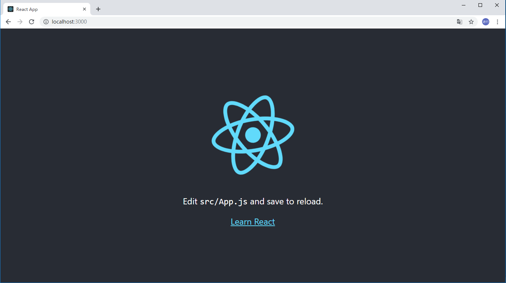
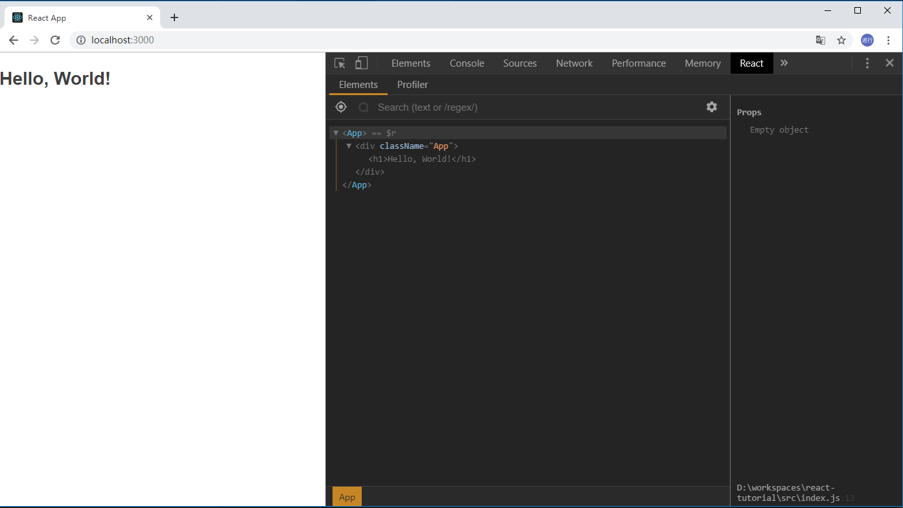
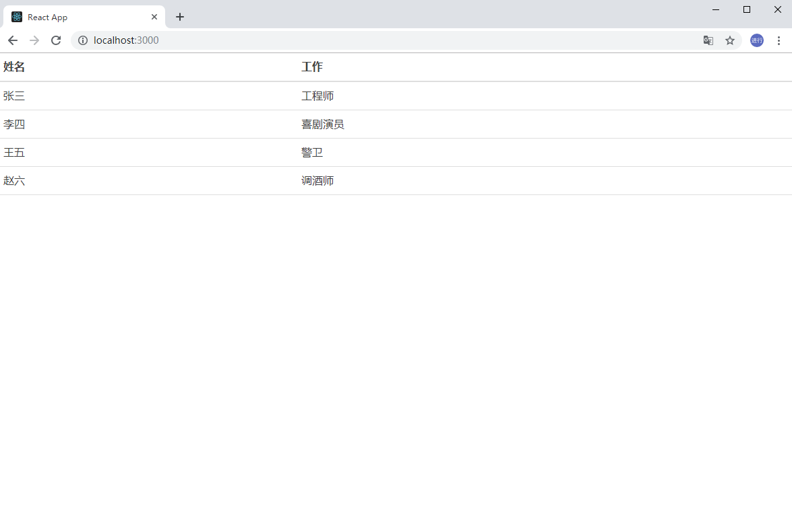
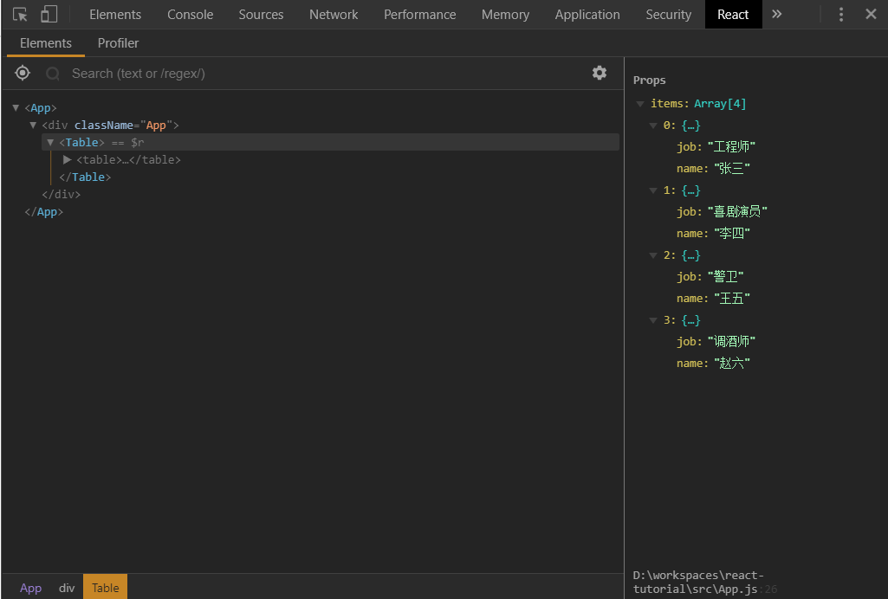
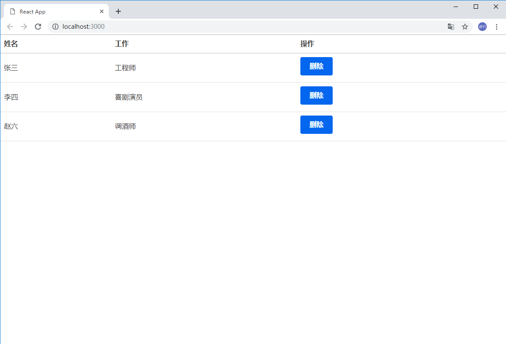
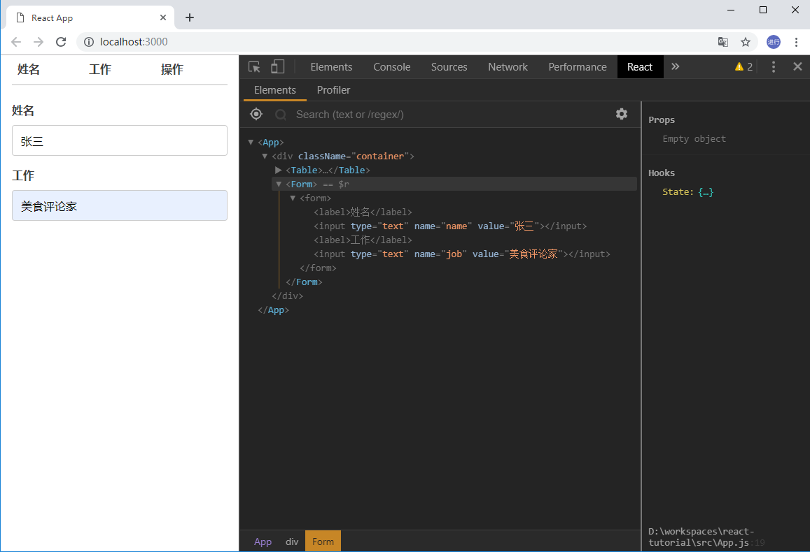
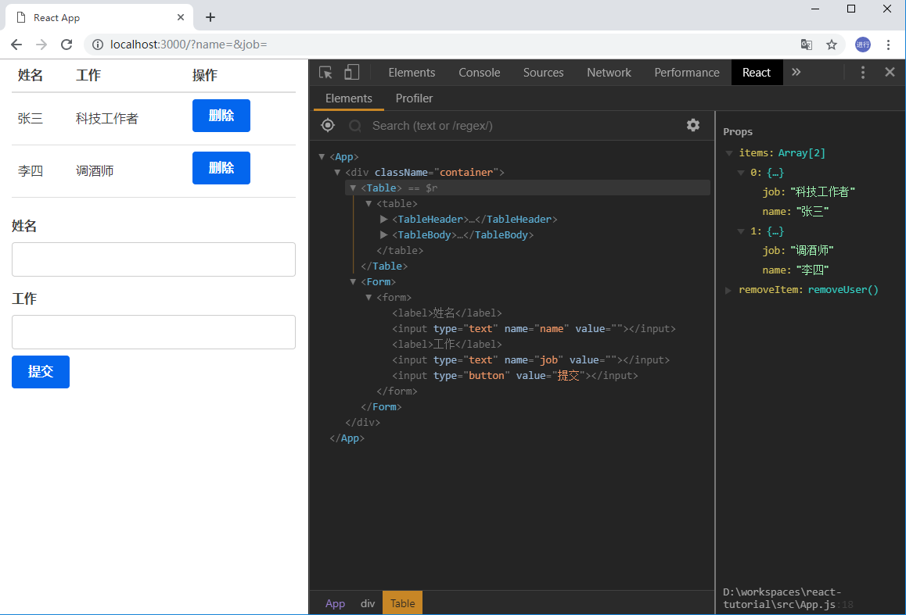
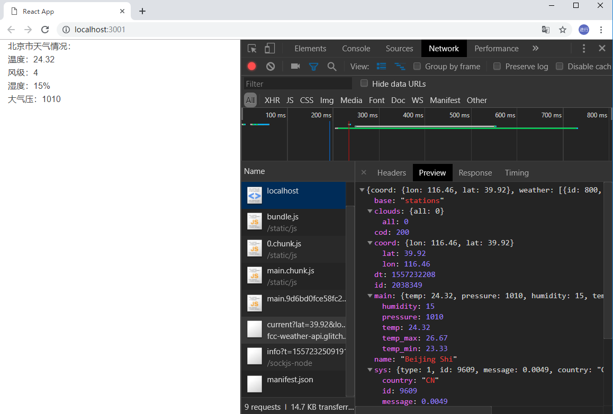

## 准备

在开始学习 React 之前，需要你掌握一些基本的 Web 开发知识，包括：

- 熟悉 HTML & CSS
- 知道并有 JavaScript 编程经验
- 清楚什么是 DOM
- 熟悉[ES6 语法](http://es6.ruanyifeng.com/)

在电脑上需要安装以下环境：

- [node.js 和 npm](https://nodejs.org/en/)
- [代码编辑器：vscode](https://code.visualstudio.com/)

## 目标

- 学习 React 基本概念和相关的东西，如 Babel、Webpack、JSX、组件、属性、状态和钩子(react hooks)。
- 构建一个演示上面概念的简单 React 应用。

[查看放在 Github 上的源码](https://github.com/sinoui/react-tutorial)

[查看最终效果](https://sinoui.github.io/react-tutorial/)

## React 是什么？

- React 是最受欢迎的 JavaScript 库之一，[在 Github 上有 超过 10 万星星](https://github.com/facebook/react)。
- 它不是一个框架（不像 Angular 那样提供了很多框架功能）。
- React 是由 Facebook 开源的项目。
- React 用来在前端构建 UI（user interfaces，用户界面）。
- React 是 MVC（Model View Controller） 应用程序中的**视图层**。

React 最重要的一个特性是你可以创建组件（类似于自定义、可重用的 HTML 元素），以快速有效地构建用户界面。React 还使用**状态**和**属性**简化了数据的存储和处理。

## 创建并安装 React 项目

有很多种方式创建 React 项目，这里将提供一种相对简单的方式。

### create-react-app

Facebook 提供了[Create React App](https://github.com/facebook/create-react-app)，可以快速搭建一个 React 项目。它会创建一个实时的开发服务器，用 Webpack 自动编译 React、JSX 和 ES6，自动处理 CSS 文件，并会用 ESLint 检查代码错误。

要设置`create-react-app`，请在终端中运行以下代码。这个命令行会在当前目录创建一个 React 项目，所以，请在您希望项目所在的目录上执行命令行代码。请确保你的 Node.js 是 5.2+版本的。

```shell
npx create-react-app react-tutorial
```

执行完上面的命令行代码后，移动到新创建的目录并启动项目。

```shell
cd react-tutorial
npm start
```

执行上面的命令行代码后，会弹出`http://localhost:3000`页面的浏览器窗口，页面会呈现你的 React 应用程序。



你可以在 vscode 中打开`react-tutorial`（将这个文件夹拖拽到 vscode 窗口即可打开此项目），查看一下目录结构：

```text
react-tutorial
|__ node_modules
|__ public
|__ src
  |__ App.css
  |__ App.js
  |__ index.css
  |__ index.js
|__ .gitignore
|__ package.json
|__ README.md
```

打开`public/index.html`文件，这个 HTML 文件中有一个非常重要的`div`元素，它的`id`为`root`，稍后会看到项目的代码会将 React 渲染在这个 div 中。项目的源码放在`src/`目录中。

打开`src/index.js`文件，找到下面一行代码：

```jsx
ReactDOM.render(<App />, document.getElementById("root"));
```

这行代码的意思是将`<App />`渲染在`#root`的 DOM 元素中。

可以体验一下`create-react-app`的自动编译和刷新的功能，打开`src/App.js`，找到下面的代码：

```html
Edit <code>src/App.js</code> and save to reload.
```

替换成任意内容，比如`Hello, World!`。保存之后，你会看到`http://localhost:3000`页面会自动刷新为新的内容。

现在，将`src/`中所有的文件都删除掉，我们从头开始。首先创建`index.js`和`index.css`两个文件。

在`index.css`文件中粘贴[Primitive CSS](primitive.css)文件中的内容。你也可以使用 Bootstrap 的样式或者其他 CSS 框架的样式，也可以省略这一步。

现在，在`index.js`中导入 React、ReactDOM 和`index.css`：

```jsx
import React from "react";
import ReactDOM from "react-dom";
import "./index.css";
```

再创建一个 App 组件。代码如下：

```jsx
function App() {
  return (
    <div className="App">
      <h1>Hello, World!</h1>
    </div>
  );
}
```

App 组件中有一个`class`为`App`的`div`，`div`中包含了`h1`标签。需要特别注意的是，在 JavaScript 代码中，需要使用`className`来定义标签的`class`。

最后，我们在`#root`标签中渲染出`App`：

```jsx
ReactDOM.render(<App />, document.getElementById("root"));
```

至此，`src/index.js`文件就完成了。完整的代码如下：

```jsx
import React, { Component } from "react";
import ReactDOM from "react-dom";
import "./index.css";

function App() {
  return (
    <div className="App">
      <h1>Hello, React!</h1>
    </div>
  );
}

ReactDOM.render(<App />, document.getElementById("root"));
```

现在，再看看`http://localhost:3000`页面，页面上会呈现出`Hello, World!`。👏 我们完成了 React 应用的开始部分。

### 调试 React

有一个 React Developer Tools 插件，可以辅助调试 React 页面。请在 Chrome 浏览器上下载并安装[ React DevTools for Chrome](https://chrome.google.com/webstore/detail/react-developer-tools/fmkadmapgofadopljbjfkapdkoienihi)（需要翻墙）。

安装完成后，在`http://localhost:3000`页面上，按`F12`键打开`devtools`，你将会看到 React 标签。点击它，这样你可以在编写组件时对其进行检查。现在看起来不是很有用，但是随着应用越来越复杂，它的作用就会凸显出来。



## JSX: JavaScript + HTML

如你所见，在 React 代码中出现了 HTML，但这不是真正的 HTML。它是`JSX`，是`JavaScript XML`的缩写。

使用 JSX，我们可以编写看似 HTML 的内容，也可以创建和使用我们自己的类似 XML 的标签。这是 JSX 看起来分配给变量的内容。

```jsx
const heading = <h1 className="site-heading">Hello, React</h1>;
```

React 并不强制使用 JSX。在底层，JSX 会被替换成`createElement`，它接受标记，包含属性的对象和组件的子项，并呈现相同的信息。以下代码将具有与上述`JSX`相同的输出。

```jsx
const heading = React.createElement(
  "h1",
  {
    className: "site-heading"
  },
  "Hello, React"
);
```

JSX 实际上更接近 JavaScript，而不是 HTML，因此在编写时需要注意几个关键的区别。

- 使用`className`代替`class`添加 CSS 类。因为在 JavaScript 中`class`是关键字。
- 在 JSX 中属性名称和事件名称采用小驼峰式（camelCase），如`onclick`应写成`onClick`。
- 自关闭标签必须以斜线结尾，如``。
- 使用 JSX 语法时你需要传入一个函数作为事件处理函数，而不是一个字符串。

例如，传统的 HTML 是这样写的：

```html
<button onClick="alert('我被点击了')">点击我</button>
```

在 JSX 中，应写成下面的方式：

```jsx
<button onClick={() => alert("我被点击了")}>点击我</button>
```

可以在 JSX 中使用大括号的方式嵌入 JavaScript 表达式，如变量、方法和属性。

```jsx
const name = "Jacking";
const heading = <h1>Hello, {name}</h1>;
```

JSX 使我们在 JavaScript 中创建和维护元素变得简单。这也是大家喜欢 React 的一个原因。

## 组件

到目前为止，我们已经创建了一个组件——`App`组件。React 中几乎所有内容都由组件组成。组件可以是**函数组件**或者是**类组件**。

大部分 React 程序有很多小组件，而且都会加载到`App`组件中去。**组件一般都会有自己的文件**，所以让我们改变我们的程序以做到这一点。

从`src/index.js`中删除`App`，并添加上`./App`的导入：

`src/index.js`

```jsx
import React from "react";
import ReactDOM from "react-dom";
import "./App";
import "./index.css";

ReactDOM.render(<App />, document.getElementById("root"));
```

然后在`src/`目录下创建一个新的`App.js`文件，内容如下：

```jsx
import React from "react";

function App() {
  return (
    <div className="App">
      <h1>Hello, World!</h1>
    </div>
  );
}

export default App;
```

我们将组件导出为`App`，并将其加载到`index.js`中。将组件分离到独立的文件并不是强制的，但是如果不这么做，你的程序将会变得很难维护。

### 函数组件

React 16.8 推出 React Hooks 后，类组件变得不那么重要了，所以这里我们从函数组件开始介绍。

让我们来创建一个新的组件，这个组件将以表格的方式展现一组人员信息，代码如下：

`src/Table.js`:

```jsx
import React from "react";

function Table() {
  return (
    <table>
      <thead>
        <tr>
          <th>姓名</th>
          <th>工作</th>
        </tr>
      </thead>
      <tbody>
        <tr>
          <td>张三</td>
          <td>工程师</td>
        </tr>
        <tr>
          <td>李四</td>
          <td>喜剧演员</td>
        </tr>
        <tr>
          <td>王五</td>
          <td>警卫</td>
        </tr>
        <tr>
          <td>赵六</td>
          <td>调酒师</td>
        </tr>
      </tbody>
    </table>
  );
}

export default Table;
```

我们创建了一个自定义的函数组件。我们需要将自定义组件的名称首字母大写，以区分常规的 HTML 元素。回到`App.js`文件，将 Table 载入其中。首先我们需要导入 Table：

```jsx
import Table from "./Table";
```

然后，我们将`<h1>`替换成`<Table />`，如下所示：

```jsx
return (
  <div className="App">
    <Table />
  </div>
);
```

完整的`src/App.js`代码如下：

```jsx
import React from "react";
import Table from "./Table";

function App() {
  return (
    <div className="App">
      <Table />
    </div>
  );
}

export default App;
```

打开`http://localhost:3000`页面，你会看到如下的效果。



这样我们就创建了一个自定义的函数组件。我们可以在任何地方重复使用这个组件。当然，这个组件有一个问题——它的数据是在组件中硬编码的（写死的），这样它的用途就不大。这个问题我们在属性章节解决它。

我们看到表格由表头(table header)和表内容(table body)组成，我们可以将它们拆分为两个独立的组件——TableHeader 和 TableBody。

`src/TableHeader.js`:

```jsx
import React from "react";

function TableHeader() {
  return (
    <thead>
      <tr>
        <th>姓名</th>
        <th>工作</th>
      </tr>
    </thead>
  );
}

export default TableHeader;
```

`src/TableBody.js`:

```jsx
import React from "react";

function TableBody() {
  return (
    <tbody>
      <tr>
        <td>张三</td>
        <td>工程师</td>
      </tr>
      <tr>
        <td>李四</td>
        <td>喜剧演员</td>
      </tr>
      <tr>
        <td>王五</td>
        <td>警卫</td>
      </tr>
      <tr>
        <td>赵六</td>
        <td>调酒师</td>
      </tr>
    </tbody>
  );
}

export default TableBody;
```

`src/Table.js`:

```jsx
import React from "react";
import TableHeader from "./TableHeader";
import TableBody from "./TableBody";

function Table() {
  return (
    <table>
      <TableHeader />
      <TableBody />
    </table>
  );
}

export default Table;
```

我们看到，组件可以嵌套其他组件。接下来讲解一下类组件。在没有出现 React Hooks 之前，类组件是非常常用的组件形式，所以咱们通过百度等查找到的 React 组件资料，会充斥非常多的类组件形式。

### 类组件

这一小节，我们将`Table`组件用类组件的方式实现一下：

```jsx
import React from "react";
import TableHeader from "./TableHeader";
import TableBody from "./TableBody";

class Table extends React.Component {
  render() {
    return (
      <table>
        <TableHeader />
        <TableBody />
      </table>
    );
  }
}

export default Table;
```

类组件可以和函数组件相互混合着使用。

## 属性

目前，`Table`组件只能渲染出固定的几个人的信息，这不是我们想要的效果，并且这样的`Table`组件也不够复用。在 React 中，使用`属性(props)`和`状态(state)`来处理数据。先来讲讲属性的方式如何处理数据。

首先，移除`TableBody`组件中的数据。

`src/TableBody.js`:

```jsx
function TableBody() {
  return <tbody />;
}
```

然后，我们将数据放在一个 JavaScript 对象数组中。我们可以在`App`组件中创建这个数组。

```jsx
function App() {
  const users = [
    {
      name: "张三",
      job: "工程师"
    },
    {
      name: "李四",
      job: "喜剧演员"
    },
    {
      name: "王五",
      job: "警卫"
    },
    {
      name: "赵六",
      job: "调酒师"
    }
  ];

  return (
    <div className="App">
      <Table />
    </div>
  );
}
```

现在，我们使用属性将数据传递给子组件（`Table`），类似于你通过`data-`属性给 HTML 元素传递数据。我们可以随便给组件取名，只要它不是关键字即可，我们给它取名为`items`。我们要传递的数据是`users`变量。因为它是一个 JavaScript 表达式，所以需要使用大括号。

```jsx
return (
  <div className="App">
    <Table items={users} />
  </div>
);
```

现在我们已经将数据传递给`Table`，我们必须努力在另一端（`Table`组件内部）访问它。

```jsx
function Table(props) {
  const { items } = props;

  return (
    <table>
      <TableHeader />
      <TableBody items={items} />
    </table>
  );
}
```

可以打开 React DevTools 查看一下`Table`组件，你会看到`items`属性对应着一个数组。这里存储的数据称为**虚拟 DOM（virtual DOM）**，这是一种快速有效的保持数据和实际 dom 同步的技术。



然而，数据还没有出现在真实 DOM 中。在`Table`组件中，我们可以通过`props`访问所有的属性。刚刚我们是通过`items`属性传递的数据，所以我们可以用表达式`props.items`访问到传递过来的数据。

可以用 ES6 的属性简写（ES6 对象展开）来创建一个包含`props.items`的变量。

```jsx
const { items } = props;
```

`Table`组件是由两个更小的组件组成。我们再一次使用属性将数据传递给`TableBody`。

`src/Table.js`:

```jsx
function Table(props) {
  const { items } = props;

  return (
    <table>
      <TableHeader />
      <TableBody items={items} />
    </table>
  );
}
```

当前，`TableBody`没有任何形参，并只返回了`tbody`空标签。

```jsx
const TableBody = () => {
  return <tbody />;
};
```

我们可以使用`数组的map`函数为数组中的每一个对象创建一个表格行。

```jsx
function TableBody(props) {
  const rows = props.items.map((row, index) => (
    <tr key={index}>
      <td>{row.name}</td>
      <td>{row.job}</td>
    </tr>
  ));

  return <tbody>{rows}</tbody>;
}
```

打开页面看看吧，现在数据已经展现出来了。

我在每一个`tr`上添加了`key`。在 React 中，在创建列表时应一直使用[keys](https://zh-hans.reactjs.org/docs/lists-and-keys.html#keys)，这样做有助于识别每一个列表项。待会儿，当我们需要维护列表项时，你就会看到它的必要性。

属性是将现有数据传递给 React 组件的有效方式，然而组件不能更改属性——**属性是只读的**。接下来，我们会学习到如何使用`状态`维护数据。

## 状态

我们在一个数组变量中存储了人员数据，并通过属性传递给了`Table`组件。这是一个好的开始，但是我们怎么删除一个人员呢？使用属性，我们有了单向数据流，使用状态，我们就可以更新组件的私有数据。

你可以将状态看成是任何需要保存或者修改但是不需要添加到数据库中的数据，比如，从购物车中添加或者删除商品。

首先，我们需要创建一个状态。

`src/App.js`:

```jsx
import React, { useState } from "react";

function App() {
  const [users, setUsers] = useState();
}
```

接着将整个对象数组迁移到`users`状态中。

`src/App.js`:

```jsx
import React, { useState } from "react";

function App() {
  const [users, setUsers] = useState([
    {
      name: "张三",
      job: "工程师"
    },
    {
      name: "李四",
      job: "喜剧演员"
    },
    {
      name: "王五",
      job: "警卫"
    },
    {
      name: "赵六",
      job: "调酒师"
    }
  ]);
}
```

现在，数据已经存储在状态中。需要将`users`状态存储的数据传递给`Table`组件。

`src/App.js`:

```jsx
import React, { useState } from "react";

function App() {
  const [users, setUsers] = useState([
    {
      name: "张三"
      // 剩下的数据
    }
  ]);

  return (
    <div className="App">
      <Table items={users} />
    </div>
  );
}
```

既然我们想要从表格中删除一个人员，那么我们在`App`组件中创建`removeUser`方法。我们可以通过`setUsers`方法更新状态。

`src/App.js`:

```jsx
const removeUser = index => {
  setUsers(users.filter((user, i) => index !== i));
};
```

`filter`方法并没有更新当前的数组而是创建了一个新数组，它会过滤掉不符合条件的数据项，符合条件的数据项就会组成新的数组。filter 是 JavaScript 中删除数组元素的首选方法。

现在我们需要将`removeUser`传递给组件，并且在每一个列表行上渲染一个按钮，点击这个按钮调用这个方法。我们通过属性的方式将`removeUser`方法传递给`Table`组件。

`src/App.js`:

```jsx
return (
  <div className="App">
    <Table items={users} removeItem={removeUsers} />
  </div>
);
```

接着我们在`Table`组件中将这个函数传递给`TableBody`。

`src/Table.js`:

```jsx
function Table(props) {
  const { items, removeItem } = props;

  return (
    <table>
      <TableHeader />
      <TableBody items={items} removeItem={removeItem} />
    </table>
  );
}
```

`TableBody`中，在调用`removeItem()`时，将数据对应的索引号（index）作为参数传递给了`removeItem()`方法，这样过滤方法就知道该删除哪个数据项了。创建一个按钮，并在`onClick`中调用`removeItem()`。删掉保存之后，你会看到

```jsx
function TableBody(props) {
  const { items, removeItem } = props;

  const rows = items.map((item, index) => (
    <tr key={index}>
      <td>{item.name}</td>
      <td>{item.job}</td>
      <td>
        <button onClick={() => removeItem(index)}>删除</button>
      </td>
    </tr>
  ));

  return <tbody>{rows}</tbody>;
}
```

现在，在页面上出现了删除按钮，并且点击删除按钮后，我们从状态中删除了这条数据。例如，我们点击“王五”这一条数据的删除按钮后，页面效果如下。



现在，你看到了如何初始化和修改状态数据。下面，将详细讲解一下用来创建状态的钩子：[useState](https://zh-hans.reactjs.org/docs/hooks-state.html)。

### useState()

我们可以用`useState()`来创建和维护一个状态。如上面的例子，我们创建了一个`users`状态。

```jsx
const [users, setUsers] = useState([...]);
```

`useState()`的返回值是一个数组，数组的第一项是状态数据，第二项是更新状态的方法。`useState()`接受一个参数，这个参数将会成为这个状态的初始数据。

访问状态数据：

```jsx
<Table items={users} />
```

更新状态数据：

```jsx
const newUsers = users.filter((user, i) => i !== index);
setUsers(newUsers);
```

我们可以多次调用`useState()`，为组件创建多个状态。

```jsx
const [users, setUsers] = useState([...]); // 人员列表状态
const [isLoading, setIsLoading] = useState(false); // 加载数据的状态
```

大家在百度上搜索的介绍 React 状态的文章，大部分应该是基于类组件的语法，而不是`useState()`的方式。在这里，建议大家直接搜索`useState`，或者多看看[React 官方文档的说明](https://zh-hans.reactjs.org/docs/hooks-state.html)。

## 提交表单数据

到目前为止，我们已经将数据存储在状态中，并可以从状态中删除数据项。现在，我们面临一个新需求：如何添加数据项？在现实世界中，大部分情况下是从一个空列表开始添加数据项，比如待办列表、购物车。

首先，清空初始化的数据项——将`App.js`中的`users`状态的初始化数据设置为空数组（`[]`）。

`app.js`:

```jsx
function App() {
  const [users, setUsers] = useState([]);
}
```

接着，我们创建一个新组件`Form`。表单中包含了用户名和工作两个变化的数据，所以需要用状态来存储。初始情况下，用户名和工作都是空字符串。

```jsx
import React, { useState } from "react";

function Form() {
  const initialFormData = {
    name: "",
    job: ""
  };

  const [formData, setFormData] = useState(initialFormData);
}

export default Form;
```

我们的目标是表单中的每一个表单项发生变化时更新`formData`状态，并且在我们提交表单时，将数据传递给`App`组件中的`users`状态。当`App`组件的`users`状态发生变化时，我们的`Table`组件就会同步更新。

首先，我们创建一个函数，用来监听表单项发生变化的事件。这个函数会接收到`event`参数，这个参数代表表单项值变化事件。`event`中有`name`和`value`两个属性，代表表单项的名称和值。

```jsx
const handleChange = event => {
  const { name, value } = event.target;

  seteFormData({
    ...formData,
    [name]: value
  });
};
```

然后在`Form`组件中添加两个输入框。我们从`formData`状态中取出`name`和`job`，分别传递给用户名、工作输入框（通过`value`属性）。然后将`haneleChange`传递给输入框的`onChange`属性，这样完成了表单项值变化监听。

```jsx
import React, { useState } from "react";

function Form() {
  const initialFormData = {
    name: "",
    job: ""
  };

  const [formData, setFormData] = useState(initialFormData);

  const handleChange = event => {
    const { name, value } = event.target;

    seteFormData({
      ...formData,
      [name]: value
    });
  };

  const { name, job } = formData;

  return (
    <form>
      <label>用户名</label>
      <input type="text" name="name" value={name} onChange={handleChange} />
      <label>工作</label>
      <input type="text" name="job" value={job} onChange={handleChange} />
    </form>
  );
}

export default Form;
```

在`App.js`中，我们在表格之下渲染这个表单。

`App.js`:

```jsx
return (
  <div className="container">
    <Table items={users} removeItem={removeUser} />
    <Form />
  </div>
);
```

打开`http://localhost:3000`页面，就会看到页面上多出了一个表单。在表单中输入一些值，就会在 React DevTools 中看到表单状态和表单项的属性变化。



最后一步我们来处理一下表单数据提交。我们在`App.js`中创建一个`addUser()`方法，会将新的`user`参数添加到`users`状态中。这里使用[ES6 展开操作符](https://developer.mozilla.org/zh-CN/docs/Web/JavaScript/Reference/Operators/Spread_syntax)。

`App.js`:

```jsx
const addUser = user => {
  setUsers([...users, user]);
};
```

接着将`addUser`传递给`Form`组件。

```jsx
<Form handleSubmit={addUser} />
```

在`Form`组件内部，创建一个`submitForm()`方法，它会调用通过属性传递过来的`handleSbumit()`方法，并且会将表单状态传递给之前定义的`user`参数。`submitForm()`也会重置表单状态为初始状态，这样就可以在提交表单后清空表单。

`Form.js`:

```jsx
const { handleSubmit } = props;
const submitForm = () => {
  handleSubmit(formData);
  setFormData(initialFormData);
};
```

最后，我们添加一个提交按钮，将`handleSubmit`传递给这个按钮的`onClick`属性，这样，当按钮点击时，就会调用`handleSubmit()`方法，完成表单提交。

```jsx
<input type="button" value="提交" onClick={handleSubmit} />
```

这就是全部了，应用完成了。我们从页面上添加和删除人员后，`Table`和`TableBody`均能正确的展现人员数据，这是因为`Table`和`TableBody`组件与状态是同步的。



打开<https://github.com/sinoui/react-tutorial>可查看完整的代码。

## 与后端 API 交互

从 API 中获取数据是前端应用中常见场景。如果你不熟悉如何与 API 交互，建议你先学习一下[Fetch API](https://developer.mozilla.org/zh-CN/docs/Web/API/Fetch_API/Using_Fetch)或者[Axios](https://github.com/axios/axios)。

这个章节将会用[Fetch API](https://developer.mozilla.org/zh-CN/docs/Web/API/Fetch_API/Using_Fetch)获取[北京的天气数据](https://fcc-weather-api.glitch.me/api/current?lat=39.92&lon=116.46)，并在页面上展现北京市当前的天气情况。

这个章节不再从零开始讲解如何创建一个 React 应用和创建组件。这里重点讲解一个新的 React 钩子[useEffect](https://zh-hans.reactjs.org/docs/hooks-effect.html)。它有很多用途，其中之一就是可以在组件创建完成后执行一些 JavaScript 代码（在这里执行的 JavaScript 代码，我们称之为副作用）。我们的应用期望在组件创建后，立马访问气象 API 获取北京市气象数据。代码如下。

`src/App.js`:

```jsx
import React, { useState, useEffect } from "react";

function App() {
  const [weather, setWeather] = useState();

  useEffect(() => {
    const url =
      "https://fcc-weather-api.glitch.me/api/current?lat=39.92&lon=116.46";

    fetch(url)
      .then(result => result.json())
      .then(result => setWeather(result));
  }, []);

  if (weather) {
    return (
      <div className="container">
        <div>北京市天气情况：</div>
        <div>温度：{weather.main.temp}</div>
        <div>风级：{weather.wind.speed}</div>
        <div>湿度：{weather.main.humidity}%</div>
        <div>大气压：{weather.main.pressure}</div>
      </div>
    );
  } else {
    return <div>正在获取北京市天气数据...</div>;
  }
}

export default App;
```

启动应用后，就能看到北京市的天气预报了。我们可以打开 devtools，查看`Network`页签，刷新一下页面，找到`https://fcc-weather-api.glitch.me`这个请求，点击`Preview`页签，能够预览这个天气 API 的响应数据。



## 编译并部署 React 项目

开发环境与生产环境是有很大区别的。在开发环境中，注重的是开发者体验，而在生产环境，需要考虑的是性能。为了在生产环境中运行 React 应用，我们需要编译并部署项目。

我们可以通过下面的命令行编译 React 项目。

```shell
npm run build
```

执行完后，会产生一个`build`文件夹。这个文件夹就是项目编译后的文件。将 build 文件夹推送到 Nginx 或者其他服务器上就完成了部署。这里介绍两种方式部署场景。

### serve

为了在本地快速预览编译后的效果，可以使用[serve](https://www.npmjs.com/package/serve)这个工具来启动编译后的 React 项目。

```shell
npx serve -s build
```

在浏览器中打开<http://localhost:5000>页面，就能看到效果。

### github pages

如果你熟悉[Github](http://github.com/)，那么可以接着往下看，否则先百度一下如何创建 Github 账号并使用 Github。

[Github Pages](https://pages.github.com/)可以用来快速搭建你的站点。我们可以将编译后的项目部署到 Github Pages 上。

首先打开项目的`package.json`，添加上`homepage`，配置上你的项目的 url。

`package.json`:

```json
  "homepage": "https://sinoui.github.io/react-tutorial",
```

在`scripts`部分添加两行代码：

```json
"scripts": {
  // ...
  "predeploy": "npm run build",
  "deploy": "gh-pages -d build"
}
```

安装`gh-pages`依赖。

```shell
npm install --save-dev gh-pages
```

然后我们执行`deploy`指令，将项目发布到 github pages 上。

```shell
npm run deploy
```

入门程序的构建旅程到此结束。看看成效吧：<https://sinoui.github.io/react-tutorial/>。

## 总结

这篇文章是一个很好的开始，它向大家介绍了 React、JSX、组件、属性、状态、表单处理、与 API 交互以及部署应用。我们还有很多 React 相关知识需要学习，但是我希望这篇文章能够带给大家向未知前进的信心。

[查看放在 Github 上的源码](https://github.com/sinoui/react-tutorial)

[查看最终效果](https://sinoui.github.io/react-tutorial/)

如果这篇文章有不正确或者不明确的地方，请[告知我们](https://github.com/sinoui/sinoui-guide/issues)（添加 github issue）。

## 参考文章

- [React 官方教程](https://zh-hans.reactjs.org/docs/hello-world.html)
- [Getting Started with React](https://www.taniarascia.com/getting-started-with-react/)
- [React Hooks](https://zh-hans.reactjs.org/docs/hooks-intro.html)
