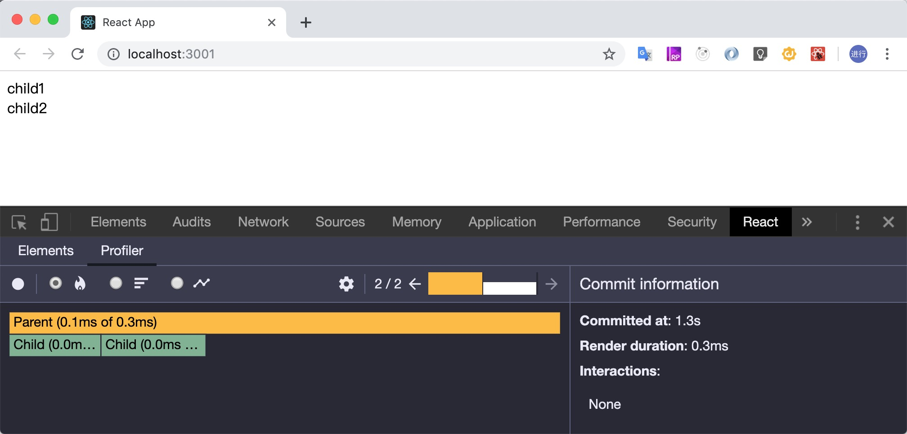
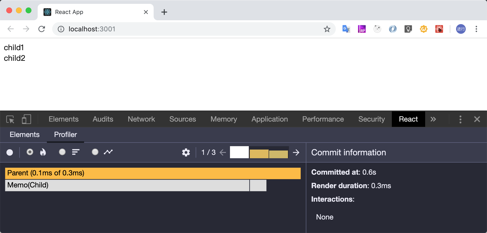
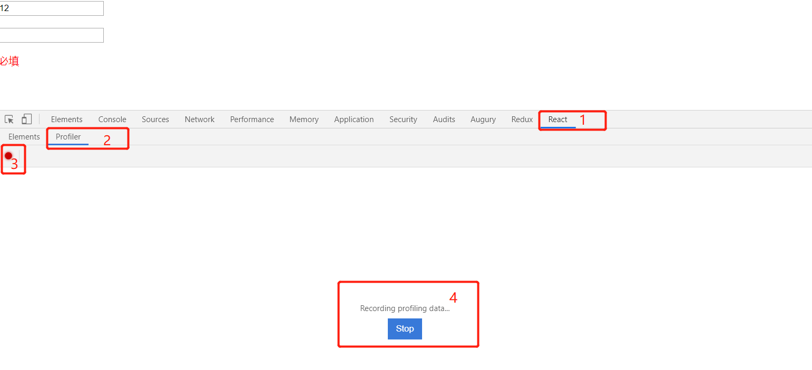
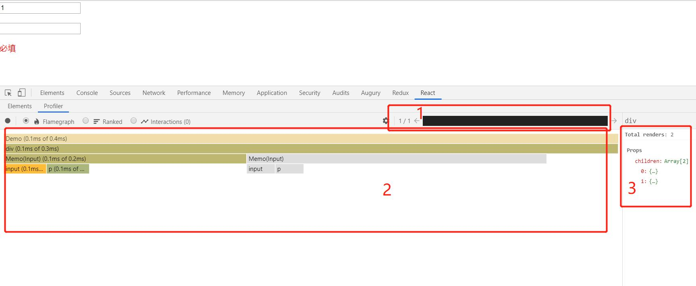
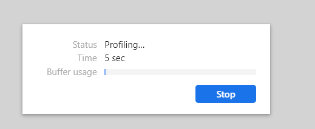
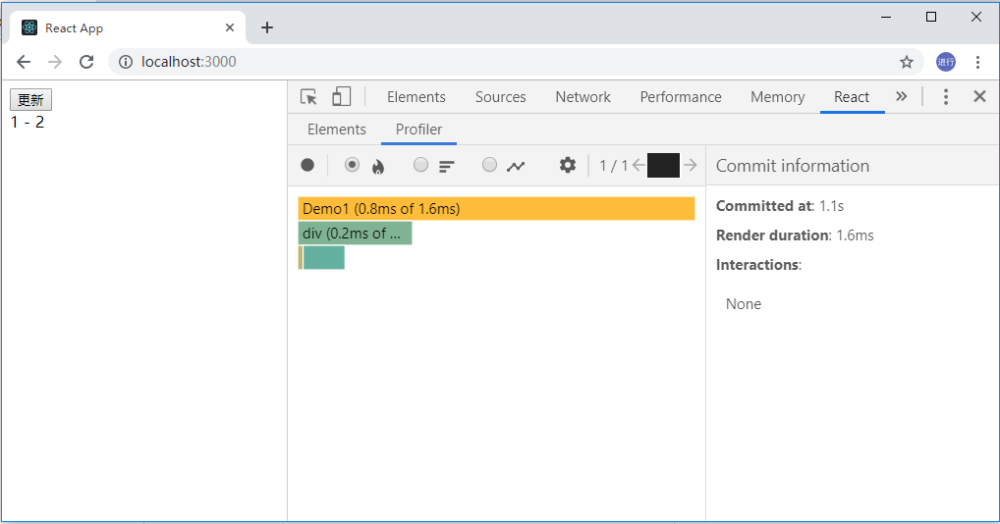
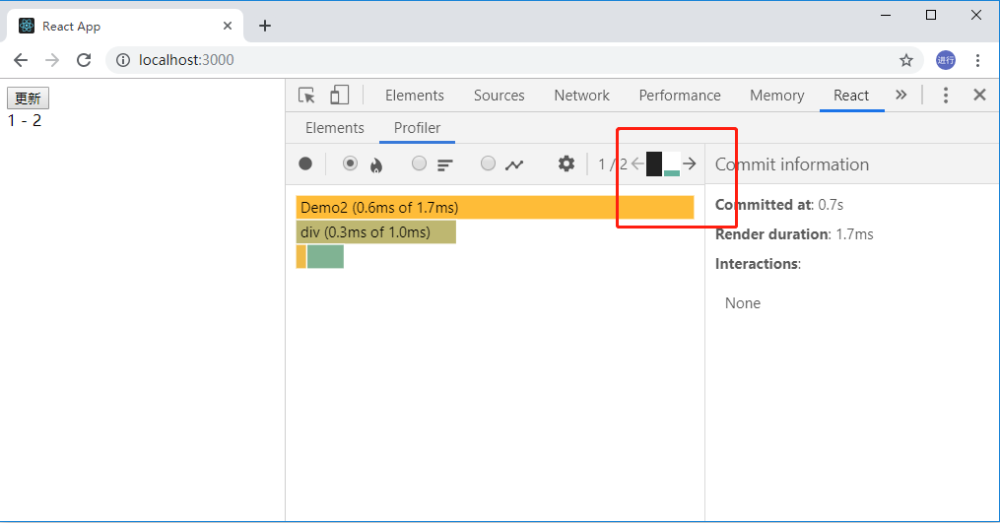

> 注意：此文档还在修改状态。

## 组件缓存

由于 React 并不知道在父组件中的更新是否会影响到其子代，所以 React 会在父组件更新时，将其所有子代也重绘，这会导致很大的性能消耗。为了减少这种不必要的性能损耗，我们可以使用**缓存**的方式处理子组件。这样当`props`浅层比较的结果相同时，父组件发生变化时，React 会去缓存中重用子组件先前的渲染结果，而不是重新渲染子组件。

> 使用[React.memo()](https://zh-hans.reactjs.org/docs/react-api.html#reactmemo)做组件缓存。

下面我们来对比看下使用缓存前后对性能的影响：

使用前：

```tsx
import React, { useState, useEffect } from 'react';
import ReactDOM from 'react-dom';

interface Props {
  title: string;
}

function Child(props: Props) {
  return <div>{props.title}</div>;
}

function Parent() {
  const [, setCount] = useState(0);

  useEffect(() => {
    // 每隔一秒钟重绘一次组件
    setInterval(() => {
      setCount((prev) => prev + 1);
    }, 1000);
  }, []);

  return (
    <div>
      <Child title="child1" />
      <Child title="child2" />
    </div>
  );
}

ReactDOM.render(<Parent />, document.getElementById('root'));
```

`Parent`组件每隔一秒钟发生一次状态变更，两个`Child`组件也会发生重绘，如下面的 React 渲染火焰图所示（绿色方格代表发生了重绘）：



为了避免不必要的渲染，我们可以对上述示例稍加调整：

```tsx
import React, { useState, useEffect } from 'react';
import ReactDOM from 'react-dom';

interface Props {
  title: string;
}

function Child(props: Props) {
  return <div>{props.title}</div>;
}

const MemoChild = React.memo(Child);

function Parent() {
  const [, setCount] = useState(0);

  useEffect(() => {
    // 每隔一秒钟重绘一次组件
    setInterval(() => {
      setCount((prev) => prev + 1);
    }, 1000);
  }, []);

  return (
    <div>
      <MemoChild title="child1" />
      <MemoChild title="child2" />
    </div>
  );
}

ReactDOM.render(<Parent />, document.getElementById('root'));
```

这里我们使用[React.memo](https://zh-hans.reactjs.org/docs/react-api.html#reactmemo)做了组件缓存，因此在`Parent`组件状态发生变化时，两个`Child`组件因为属性没有发生变化，React 会从缓存中取其上次的渲染结果，而不是重新传染。渲染效果如下（火焰图中的两个`Memo(Child)`小方格都是灰色的，代表未发生重绘）：



### `props`浅层比较

```js
const objA = {
  a: '1',
  b: '2',
};

const objB = {
  a: '1',
  b: '2',
};

Object.keys(objA).every((key) => objA[key] === objB[key]); // true
```

#### 函数属性

##### 动态函数属性

这里我们首先来看一个示例：

```tsx
import React, { useState, ChangeEvent } from 'react';
import ReactDOM from 'react-dom';

function Input(props: any) {
  return <input type="text" value={props.value} onChange={props.onChange} />;
}

const TextInput = React.memo(Input);

function Demo() {
  const [value1, setValue1] = useState('');
  const [value2, setValue2] = useState('');

  const onChangeValue1 = (event: ChangeEvent<HTMLInputElement>) => {
    setValue1(event.target.value);
  };

  const onChangeValue2 = (event: ChangeEvent<HTMLInputElement>) => {
    setValue2(event.target.value);
  };

  return (
    <div>
      <TextInput value={value1} onChange={onChangeValue1} />
      <TextInput value={value2} onChange={onChangeValue2} />
    </div>
  );
}

ReactDOM.render(<Demo />, document.getElementById('root'));
```

思考一个问题：此时如果改变第二个`TextInput`值，第一个`TextInput`会重新渲染吗？

一定会的，看下渲染结果：


可能你会有疑问：不是已经用了`React.memo`缓存了吗？为什么还会重新渲染呢？

其实这是因为`TextInput`的`onChange`属性，这是一个用来监听值变化的回调函数，输入框的值发生改变时，`Demo`组件会重绘，而此时`onChange`属性会指向一个新的方法，此时`TextInput`的属性浅层比较会返回`false`,组件就会重新渲染。

解决上述问题有两种方式：

方式一：使用[React.useCallback](https://zh-hans.reactjs.org/docs/hooks-reference.html#usecallback)缓存处理值变化的方法

```tsx
import React, { useState, ChangeEvent, useCallback } from 'react';
import ReactDOM from 'react-dom';

function Input(props: any) {
  return <input type="text" value={props.value} onChange={props.onChange} />;
}

const TextInput = React.memo(Input);

function Demo() {
  const [value1, setValue1] = useState('');
  const [value2, setValue2] = useState('');

  const onChangeValue1 = useCallback((event: ChangeEvent<HTMLInputElement>) => {
    setValue1(event.target.value);
  }, []);

  const onChangeValue2 = useCallback((event: ChangeEvent<HTMLInputElement>) => {
    setValue2(event.target.value);
  }, []);

  return (
    <div>
      <TextInput value={value1} onChange={onChangeValue1} />
      <TextInput value={value2} onChange={onChangeValue2} />
    </div>
  );
}

ReactDOM.render(<Demo />, document.getElementById('root'));
```

上述示例中,`useCallback`的依赖项数组为`[]`，所以，`onChangeValue1`与`onChangeValue2`这两个方法只会在组件初始化时创建一次，后续组件值发生改变时，会直接使用它的`memoized`版本。因此当其中一个`TextInput`的值发生改变时，另一个`TextInput`组件的属性满足浅层比较，React 会从缓存读取其上次渲染结果，而非重新渲染。


方式二：使用[React.useReducer](https://zh-hans.reactjs.org/docs/hooks-reference.html#usereducer)处理值变化

```tsx
import React, { ChangeEvent, useReducer } from 'react';
import ReactDOM from 'react-dom';
import produce from 'immer';

interface Action {
  type: string;
  payload: any;
}

interface State {
  [name: string]: any;
}

const reducer = produce((state: State, action: Action) => {
  switch (action.type) {
    case 'CHANGE_VALUE':
      state[action.payload.name] = action.payload.value;
      return state;
    default:
      return state;
  }
});

function Input(props: any) {
  const onChangeValue = (event: ChangeEvent<HTMLInputElement>) => {
    props.dispatch({
      type: 'CHANGE_VALUE',
      payload: { name: props.name, value: event.target.value },
    });
  };
  return <input type="text" value={props.value} onChange={onChangeValue} />;
}

const TextInput = React.memo(Input);

function Demo() {
  const [state, dispatch] = useReducer(reducer, {});

  return (
    <div>
      <TextInput value={state.value1} name="value1" dispatch={dispatch} />
      <TextInput value={state.value2} name="value2" dispatch={dispatch} />
    </div>
  );
}

ReactDOM.render(<Demo />, document.getElementById('root'));
```

上述示例中，我们向子组件传递`dispatch`而不是回调函数。这样当第一个`TextInput`值发生改变时，第二个`TextInput`组件的属性并没有发生改变，因此其不会重新渲染。


##### 静态函数属性

当组件属性为一个静态函数时，为了减少不必要的渲染，我们可以将函数提升到组件外部，下面我们将通过两个实例对比提升前和提升后的影响。

组件内部处理：

```tsx
import React, { useState, ChangeEvent, useCallback } from 'react';
import ReactDOM from 'react-dom';

function Input(props: any) {
  const error = props.validate(props.value);
  return (
    <>
      <input type="text" value={props.value} onChange={props.onChange} />
      <p style={{ color: 'red' }}>{error}</p>
    </>
  );
}

const TextInput = React.memo(Input);

function Demo() {
  const [value1, setValue1] = useState('');
  const [value2, setValue2] = useState('');

  const onChangeValue1 = useCallback((event: ChangeEvent<HTMLInputElement>) => {
    setValue1(event.target.value);
  }, []);

  const onChangeValue2 = useCallback((event: ChangeEvent<HTMLInputElement>) => {
    setValue2(event.target.value);
  }, []);
    
  const validate = (value: any) => {
    if (!value) {
      return '必填';
    }
  };

  return (
    <div>
      <TextInput value={value1} onChange={onChangeValue1} validate={validate} />
      <TextInput value={value2} onChange={onChangeValue2} validate={validate} />
    </div>
  );
}

ReactDOM.render(<Demo />, document.getElementById('root'));
```

此时只要任意一个输入框的值发生改变，父组件就会重新渲染，创建新的validate函数传给子组件，这样就破坏了属性浅层比较，子组件会重新渲染。


我们对上述示例稍加调整，将`validate`提升至组件外部：

```tsx
import React, { useState, ChangeEvent, useCallback } from 'react';
import ReactDOM from 'react-dom';

function Input(props: any) {
  const error = props.validate(props.value);
  return (
    <>
      <input type="text" value={props.value} onChange={props.onChange} />
      <p style={{ color: 'red' }}>{error}</p>
    </>
  );
}

const TextInput = React.memo(Input);

function validate(value: any) {
  if (!value) {
    return '必填';
  }
}

function Demo() {
  const [value1, setValue1] = useState('');
  const [value2, setValue2] = useState('');

  const onChangeValue1 = useCallback((event: ChangeEvent<HTMLInputElement>) => {
    setValue1(event.target.value);
  }, []);

  const onChangeValue2 = useCallback((event: ChangeEvent<HTMLInputElement>) => {
    setValue2(event.target.value);
  }, []);

  return (
    <div>
      <TextInput value={value1} onChange={onChangeValue1} validate={validate} />
      <TextInput value={value2} onChange={onChangeValue2} validate={validate} />
    </div>
  );
}

ReactDOM.render(<Demo />, document.getElementById('root'));
```

我们来看下渲染结果的分析图：


从火焰图中我们可以看出，当我们改变第一个`TextInput`值时，第二个`TextInput`并没有重新渲染。这是因为当我们把校验函数提升到组件外部，即`全局作用域`中，所以无论`Demo`内部如何变化，`validate`都不会发生改变，这样第二个`TextInput`组件的属性满足浅层比较，因此不会重新渲染。

#### 数组、对象属性

##### 动态计算出的对象属性

```tsx
import React, { useState, useEffect } from 'react';
import ReactDOM from 'react-dom';

function UserInfo(props: any) {
  const { userName, age, duty, fav, birthday } = props.userInfo;

  return (
    <div>
      <div>姓名：{userName}</div>
      <div>年龄：{age}</div>
      <div>爱好：{fav}</div>
      <div>职务：{duty}</div>
      <div>出生年份：{birthday}</div>
    </div>
  );
}

const User = React.memo(UserInfo);

const data = {
  userName: '张三',
  age: 19,
  fav: '篮球、排球',
  duty: '处员',
};

function Demo() {
  const currentYear = new Date().getFullYear();

  const [, setCount] = useState(0);

  useEffect(() => {
    // 每隔一秒钟重绘一次组件
    setInterval(() => {
      setCount((prev) => prev + 1);
    }, 1000);
  }, []);

  const userInfo = {
    ...data,
    age: `${data.age}岁`,
    birthday: currentYear - data.age,
  };
  return <User userInfo={userInfo} />;
}

ReactDOM.render(<Demo />, document.getElementById('root'));
```

我们来思考一个问题：每次`Demo`组件重绘时，`UserInfo`会不会重绘？

很显然，答案是会的，因为`Demo`每次重绘，都会定义一个新的`userInfo`对象传给`UserInfo`组件，不满足其属性浅层比较，因此`UserInfo`会发生重绘。


这种情况很容易处理，我们只需要使用[React.useMemo](<https://zh-hans.reactjs.org/docs/hooks-reference.html#usememo>)缓存一下`userInfo`这个对象属性即可：

```tsx
import React, { useState, useEffect, useMemo } from 'react';
import ReactDOM from 'react-dom';

function UserInfo(props: any) {
  const { userName, age, duty, fav, birthday } = props.userInfo;

  return (
    <div>
      <div>姓名：{userName}</div>
      <div>年龄：{age}</div>
      <div>爱好：{fav}</div>
      <div>职务：{duty}</div>
      <div>出生年份：{birthday}</div>
    </div>
  );
}

const User = React.memo(UserInfo);

const data = {
  userName: '张三',
  age: 19,
  fav: '篮球、排球',
  duty: '处员',
};

function Demo() {
  const currentYear = new Date().getFullYear();

  const [, setCount] = useState(0);

  useEffect(() => {
    // 每隔一秒钟重绘一次组件
    setInterval(() => {
      setCount((prev) => prev + 1);
    }, 1000);
  }, []);

  const userInfo = useMemo(
    () => ({
      ...data,
      age: `${data.age}岁`,
      birthday: currentYear - data.age,
    }),
    [data, currentYear],
  );
  return <User userInfo={userInfo} />;
}

ReactDOM.render(<Demo />, document.getElementById('root'));
```

此时，在父组件发生重绘时，子组件是不会重新渲染的，原因是因为每次重绘，`currentYear`和`data`都没发生改变，`userInfo`一直都是第一次渲染时定义的那个，不会发生改变，这样就满足了`UserInfo`组件的浅层比较，因此不会重新渲染。


##### 静态对象属性

当组件属性为静态对象时,我们可以将其提升到组件外部的全局作用域，以此来满足子组件属性的浅层比较。这里我们给输入框添加label，并指定其样式，通过对比下面两个示例，看下静态对象属性对组件渲染的影响：

直接传递静态对象属性

```tsx
import React, { useState, ChangeEvent, useCallback } from 'react';
import ReactDOM from 'react-dom';

function Input(props: any) {
  return (
    <>
      <label style={props.labelStyle}>{props.label}</label>
      <input type="text" value={props.value} onChange={props.onChange} />
    </>
  );
}

const TextInput = React.memo(Input);

function Demo() {
  const [value1, setValue1] = useState('');
  const [value2, setValue2] = useState('');

  const onChangeValue1 = useCallback((event: ChangeEvent<HTMLInputElement>) => {
    setValue1(event.target.value);
  }, []);

  const onChangeValue2 = useCallback((event: ChangeEvent<HTMLInputElement>) => {
    setValue2(event.target.value);
  }, []);

  return (
    <div>
      <TextInput
        labelStyle={{ color: 'blue' }}
        label="用户名"
        value={value1}
        onChange={onChangeValue1}
      />
      <TextInput
        labelStyle={{ color: 'blue' }}
        label="密码"
        value={value2}
        onChange={onChangeValue2}
      />
    </div>
  );
}

ReactDOM.render(<Demo />, document.getElementById('root'));
```

改变一个输入框的值，由于`labelStyle`为对象属性，不满足`TextInput`属性的浅层比较，因此组件会重新渲染：


我们尝试将上述示例中的`lableStyle`提升至`Demo`组件外部的全局作用域中，再看下效果：

```tsx
import React, { useState, ChangeEvent, useCallback } from 'react';
import ReactDOM from 'react-dom';

function Input(props: any) {
  return (
    <>
      <label style={props.labelStyle}>{props.label}</label>
      <input type="text" value={props.value} onChange={props.onChange} />
    </>
  );
}

const TextInput = React.memo(Input);

const labelStyle = { color: 'blue' };

function Demo() {
  const [value1, setValue1] = useState('');
  const [value2, setValue2] = useState('');

  const onChangeValue1 = useCallback((event: ChangeEvent<HTMLInputElement>) => {
    setValue1(event.target.value);
  }, []);

  const onChangeValue2 = useCallback((event: ChangeEvent<HTMLInputElement>) => {
    setValue2(event.target.value);
  }, []);

  return (
    <div>
      <TextInput
        labelStyle={labelStyle}
        label="用户名"
        value={value1}
        onChange={onChangeValue1}
      />
      <TextInput
        labelStyle={labelStyle}
        label="密码"
        value={value2}
        onChange={onChangeValue2}
      />
    </div>
  );
}

ReactDOM.render(<Demo />, document.getElementById('root'));
```

将`labelStyle`提升至全局作用域，这样每次组件内部发生变化时，`labelStyle`并没有变，满足`TextInput`属性的浅层比较，因此在第一个`TextInput`值发生改变时，父组件会从缓存中取第二个`TextInput`的渲染结果，而不是重新渲染。

火焰图：


#### children属性

##### 静态`JSX`的优化 

静态`JSX`优化，可以将静态的`Jsx`部分提升到组件外部定义：

```tsx
import React from 'react';
import ReactDOM from 'react-dom';

function ChildInner(props: any) {
  return <p>{props.children}</p>;
}

const Child = React.memo(ChildInner);

function Parent() {
  const childs = (
    <>
      <Child>123</Child>
      <Child>这是文本</Child>
    </>
  );
  return <div>{childs}</div>;
}

ReactDOM.render(<Parent />, document.getElementById('root'));
```

在React应用中我们无需手动处理，可以借助[react-constant-elements工具完成](<https://babeljs.io/docs/en/babel-plugin-transform-react-constant-elements>)，需要注意的是场此插件只作用于生产环境。

## 使用工具度量React组件性能

### react-devtools

这里我们主要是用react-devtools的火焰图来做性能分析。

我们以一个具体示例来说明：

```tsx
import React, { useState, ChangeEvent, useCallback } from 'react';
import ReactDOM from 'react-dom';

function Input(props: any) {
  const error = props.validate(props.value);
  return (
    <>
      <input type="text" value={props.value} onChange={props.onChange} />
      <p style={{ color: 'red' }}>{error}</p>
    </>
  );
}

const TextInput = React.memo(Input);

function validate(value: any) {
  if (!value) {
    return '必填';
  }
}

function Demo() {
  const [value1, setValue1] = useState('');
  const [value2, setValue2] = useState('');

  const onChangeValue1 = useCallback((event: ChangeEvent<HTMLInputElement>) => {
    setValue1(event.target.value);
  }, []);

  const onChangeValue2 = useCallback((event: ChangeEvent<HTMLInputElement>) => {
    setValue2(event.target.value);
  }, []);

  return (
    <div>
      <TextInput value={value1} onChange={onChangeValue1} validate={validate} />
      <TextInput value={value2} onChange={onChangeValue2} validate={validate} />
    </div>
  );
}

ReactDOM.render(<Demo />, document.getElementById('root'));
```

react-devtools使用方式：

* 运行上述示例
* 打开F12控制台，将页签切换至`React`
* 将工具条从`Elements`切换至`Profilter`
* 点击小圆点开始分析，改变值使组件重绘点击`stop`按钮，收集分析结果



分析结果如下：



图中有三块区域：

1. 组件渲染次数
2. 每次渲染时相关组件的渲染情况（灰色代表不渲染，绿色或黄色代表重新渲染）
3. 渲染信息，包括组件的总渲染次数，渲染耗时，组件属性等信息

从上图结果不难看出，当我们改变第一个输入框的值时，父组件发生重绘，此时第一个输入框也会重新渲染，第二个输入框组件则不会重新渲染。

### performance 分析

这是 Chrome 浏览器自带的性能分析工具。

操作：

打开控制台，切换到`Performance`页签，确保 screenshots checkbox 是选中的，然后点击 controls，开始记录（windows 快捷键 shift + E），这时候 Devtools 就开始录制各种性能指标，你可以点击页面等进行各种操作，所有的操作都会被浏览器录制下来。录制期间， 可以点击 stop 进行快速操作结束录制，然后等待显示性能报告，stop 按钮位置如下图：



分析结果如下：


上图一共有三个区域：

1. overview 总览图，高度概括随时间线的变动，包括 FPS，CPU，NET
2. 火焰图，从不同的角度分析框选区域 。例如：Network，Frames, Interactions, Main 等
3. 总结区域：精确到毫秒级的分析，以及按调用层级，事件分类的整理

#### overview

Overview 窗格包含以下三个图表：

1.  FPS。每秒帧数。绿色竖线越高，FPS 越高。 FPS 图表上的红色块表示长时间帧，很可能会出现卡顿
2.  CPU。 CPU 资源。此面积图指示消耗 CPU 资源的事件类型
3.  NET。每条彩色横杠表示一种资源。横杠越长，检索资源所需的时间越长。 每个横杠的浅色部分表示等待时间（从请求资源到第一个字节下载完成的时间）

可以放大显示一部分记录，以便简化分析。使用 Overview 窗格可以放大显示一部分记录。 放大后，火焰图会自动缩放以匹配同一部分

#### 火焰图

在火焰图上看到一到三条垂直的虚线。蓝线代表 DOMContentLoaded 事件。 绿线代表首次绘制的时间。 红线代表 load 事件

在火焰图中选择事件时，Details 窗格会显示与事件相关的其他信息。

#### 总结区域

蓝色(Loading)：网络通信和 HTML 解析
黄色(Scripting)：JavaScript 执行
紫色(Rendering)：样式计算和布局，即重排
绿色(Painting)：重绘
灰色(other)：其它事件花费的时间
白色(Idle)：空闲时间

### react perf devtools

## class 组件的 shouldComponentUpdate

使用`shouldComponentUpdate()`可以让 React 知道当前状态或属性的改变是否不影响组件的输出，默认返回 ture，返回 false 时不会重新渲染。

```JS
class CounterButton extends React.Component {
  constructor(props) {
    super(props);
    this.state = {count: 1};
  }

  shouldComponentUpdate(nextProps, nextState) {
    if (this.props.color !== nextProps.color) {
      return true;
    }
    if (this.state.count !== nextState.count) {
      return true;
    }
    return false;
  }

  render() {
    return (
      <button
        color={this.props.color}
        onClick={() => this.setState(state => ({count: state.count + 1}))}>
        Count: {this.state.count}
      </button>
    );
  }
}
```

上述示例中只有当`props.color`或者`state.count`值发生变化时，组件才会重新渲染。

如果更复杂一些的组件，我们可以使用类似“浅比较”的模式来检查 `props` 和 `state` 中所有的字段，以此来决定是否组件需要更新。React 已经提供了一位好帮手来帮你实现这种常见的模式 - 你只要继承 `React.PureComponent` 就行了。所以这段代码可以改成以下这种更简洁的形式：

```jsx
class CounterButton extends React.PureComponent {
  constructor(props) {
    super(props);
    this.state = { count: 1 };
  }

  render() {
    return (
      <button
        color={this.props.color}
        onClick={() => this.setState((state) => ({ count: state.count + 1 }))}
      >
        Count: {this.state.count}
      </button>
    );
  }
}
```

## 减小视图大小

> 减小视图大小也是一个非常有用的优化手段。

比如我们有一个数据非常多的长列表，如果我们一次性渲染，肯定会性能非常差，但是如果我们只渲染看得见的部分，性能就得到了极大的提升。

下面举一个通过[windowing](https://react-window.now.sh)的例子说明一下：

```jsx
import { FixedSizeList as List } from 'react-window';

const Row = ({ index, style }) => <div style={style}>Row {index}</div>;

const Example = () => (
  <List height={150} itemCount={1000} itemSize={35} width={300}>
    {Row}
  </List>
);
```

在[CodeSandBox](https://codesandbox.io/s/github/bvaughn/react-window/tree/master/website/sandboxes/fixed-size-list-vertical)上看一下运行效果。

这个长列表有 1000 个数据项，但是一次性只渲染 10 条数据项。这个列表的性能就会非常好。

对于不可见的 UI 部分，我们都可以采用延迟渲染的技巧来减少视图大小，提升性能。

## 状态更新合并

React 对状态更新做了一个优化：同时多次设置状态，不会引起多次重绘，而只会合并为一次重绘。当然这个优化是有前提的。我们来看两个例子。

例子 1：

```tsx
import ReactDOM from 'react-dom';
import React, { useState } from 'react';

function Demo1() {
  const [A, setA] = useState();
  const [B, setB] = useState();

  const handleClick = () => {
    setA(1);
    setB(2);
  };

  return (
    <div>
      <button onClick={handleClick}>更新</button>
      <div>
        {A} - {B}
      </div>
    </div>
  );
}

ReactDOM.render(<Demo1 />, document.getElementById('root'));
```

点击例子 1 中的按钮，它会分别更新`A`和`B`两个状态，但是却只重绘了一次`Demo1`组件：



再看看例子 2：

```tsx
import ReactDOM from 'react-dom';
import React, { useState } from 'react';

function Demo2() {
  const [A, setA] = useState();
  const [B, setB] = useState();

  const handleClick = () => {
    setTimeout(() => {
      setA(1);
      setB(2);
    });
  };

  return (
    <div>
      <button onClick={handleClick}>更新</button>
      <div>
        {A} - {B}
      </div>
    </div>
  );
}

ReactDOM.render(<Demo2 />, document.getElementById('root'));
```

点击例子 2 中的按钮，你会发现`Demo2`组件重绘了两次：



分析例子 2 与例子 1 的代码不同：

```diff
import ReactDOM from 'react-dom';
import React, { useState } from 'react';

function Demo2() {
  const [A, setA] = useState();
  const [B, setB] = useState();

  const handleClick = () => {
+   setTimeout(() => {
      setA(1);
      setB(2);
+   });
  };

  return (
    <div>
      <button onClick={handleClick}>更新</button>
      <div>
        {A} - {B}
      </div>
    </div>
  );
}

ReactDOM.render(<Demo2 />, document.getElementById('root'));
```

最重要的区别是：

```ts
setTimeout(() => {
  setA(1);
  setB(2);
});
```

在`setTimeout()`中执行状态更新，每一次状态更新都会引起重绘，而不会合并为一次重绘。不仅仅是`setTimeout()`，还包括`setInterval()`、`Promise`、`web socket`、`ajax`、`Observable`等都是这样的。这是因为这些状态更新不是在 React Scheduler 中而是在其他环境中执行的。这里不深入展开对 React Scheduler 的分析，大家感兴趣的可以了解一下相关知识。

目前有两种方式解决：

方式一：使用`useReducer`：

```tsx
import ReactDOM from 'react-dom';
import React, { useReducer } from 'react';

function reducer(
  state: { A?: number; B?: number },
  action: { type: 'CHANGE' },
) {
  switch (action.type) {
    case 'CHANGE':
      return {
        A: 1,
        B: 2,
      };
    default:
      return state;
  }
}

function Demo3() {
  const [state, dispatch] = useReducer(reducer, {});

  const handleClick = () => {
    setTimeout(() => {
      dispatch({ type: 'CHANGE' });
    });
  };

  return (
    <div>
      <button onClick={handleClick}>更新</button>
      <div>
        {state.A} - {state.B}
      </div>
    </div>
  );
}

ReactDOM.render(<Demo3 />, document.getElementById('root'));
```

方式二：使用`ReactDOM.unstable_batchedUpdates()`：

```tsx
import ReactDOM from 'react-dom';
import React, { useState } from 'react';

function Demo2() {
  const [A, setA] = useState();
  const [B, setB] = useState();

  const handleClick = () => {
    setTimeout(() => {
      ReactDOM.unstable_batchedUpdates(() => {
        setA(1);
        setB(2);
      });
    });
  };

  return (
    <div>
      <button onClick={handleClick}>更新</button>
      <div>
        {A} - {B}
      </div>
    </div>
  );
}

ReactDOM.render(<Demo2 />, document.getElementById('root'));
```

`ReactDOM.unstable_batchedUpdates(fn)`会在 React Scheduler 上下文中执行`fn`函数，所以`setA(1)`和`setB(2)`就会得到 React Scheduler 的优化，只会引发一次重绘。

但是`ReactDOM.unstable_batchedUpdates()` API 还处于不稳定状态，而且是从`ReactDOM`中引出来的，就会有`React Native`的兼容性问题。建议使用`import { batch } from 'react-redux';`中的`batch`代替`ReactDOM.unstable_batchedUpdates`。

## 参考资料

- [将 React 作为 UI 运行时](https://overreacted.io/zh-hans/react-as-a-ui-runtime)
- [Why React is Not Reactive?](https://www.beautiful.ai/deck/-LIw2oTJmrrwRqvsoYgD/Why-React-is-Not-Reactive)
- [React Fiber Architecture](https://github.com/acdlite/react-fiber-architecture)
- [[Question] Keep to single setState call?](https://github.com/facebook/react/issues/10231)
- [SMOOSHCAST: React Fiber Deep Dive with Dan Abramov](https://www.youtube.com/watch?v=aS41Y_eyNrU&feature=youtu.be)
