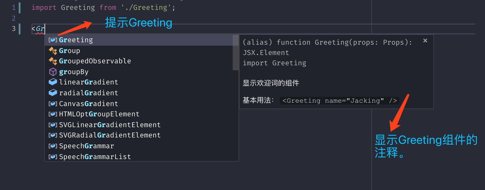
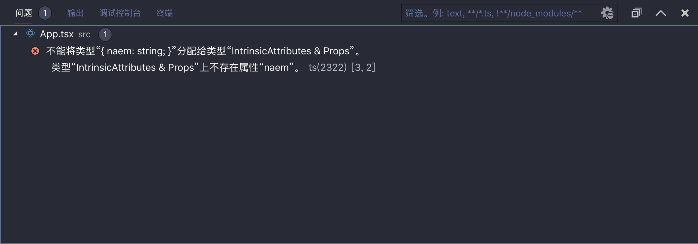

TypeScript 给 JavaScript 代码带来静态类型，这极大提升了编程体验。在 React 项目中引入 TypeScript 正是看中的**静态类型**，而且 TypeScript 原生支持 JSX 语法。本文会介绍如何在 React 应用中用好 TypeScript，提升编程体验。

预备知识：

- 熟知[ES6 语法](es6-tutorial.md)
- 熟知[TypeScript 语法](ts-tutorial.md)
- 熟知[React 基本概念](react-index.md)

如何练习本文提供的示例：

使用`create-react-app`创建一个 React TS 项目：

```bash
npx create-react-app react-ts-tutorial --typescript
```

然后使用[vscode](https://code.visualstudio.com/)打开创建的项目。

## 函数组件

我们来看一个简单的组件：

```javascript
import React from 'react';

function Greeting(props) {
  return <div>Hello, {props.name}</div>;
}

export default Greeting;
```

这个组件的用法如下所示：

```jsx
<Greeting name="Jacking" />
```

我们在第一次使用`Greeting`组件时，并不知道它有`name`属性，我们必须看它的源码实现才能知道，或者其他同事告诉你，或者有一个专门的组件文档可以查阅。能不能让 TypeScript 帮我干点事情，在用`Greeting`组件时，给点提示信息，让我们可以轻松知道组件怎么用，有哪些属性，属性的含义是什么呢？答案是肯定的。

我们稍微改造一下`Greeting`组件：

`Greeting.tsx`:

```tsx
import React from 'react';

interface Props {
  /**
   * 用户名
   */
  name: string;
}

/**
 * 显示欢迎词的组件
 *
 * 基本用法： `<Greeting name="Jacking" />`
 */
function Greeting(props: Props) {
  return <div>Hello, {props.name}</div>;
}

export default Greeting;
```

看看在使用`Greeting`组件时的智能提示：




属性名写错了会有错误提示：


问题面板中也会有相应的错误提示：



函数组件使用 TypeScript 做属性的类型声明和组件返回值类型校验，从而提升编程体验。下面我们分别看看如何使用 TypeScript 来处理不同类别的属性声明和组件返回值校验。

### 回调函数属性

这与在接口中定义函数属性没有区别，如下所示：

```tsx
import React from 'react';

interface Props {
  onClick?: (event: React.MouseEvent<HTMLButtonElement>) => void;
  children?: React.ReactNode;
}

function Button(props: Props) {
  return <button onClick={props.onClick}>{props.children}</button>;
}

export default Button;
```

### 子元素（children）

组件有可能需要子元素，也有可能不需要子元素。不需要子元素，在`Props`接口中不声明`children`属性即可。

组件的子元素常规情况下有以下几种：

- 原始数据：字符串、数字
- null、undefined
- boolean
- 单个 jsx 元素
- 多个 jsx 元素
- [portal](https://reactjs.org/docs/portals.html)

我们可以根据子组件情况选择合适的类型：

| 情况                                            | 类别                                    |
| ----------------------------------------------- | --------------------------------------- |
| 所有类别                                        | `React.ReactNode`                       |
| 原始数据：字符串、数字                          | `React.ReactText`                       |
| null、undefined                                 | `children?: React.ReactNode`(加一个`?`) |
| boolean                                         | `React.ReactNode`                       |
| 单个 jsx 元素                                   | `React.ReactElement`                    |
| 多个 jsx 元素                                   | `React.ReactNode`                       |
| [portal](https://reactjs.org/docs/portals.html) | `React.ReactPortal`                     |

推荐：

- 明确只能接收单个元素，但是不能包含原始数据（字符串、数字）：使用`React.ReactElement`
- 明确只能接收单个元素，但是可包含原始数据（字符串、数字）：使用`React.ReactChild`
- 其他的情况一律采用`React.ReactNode`，即`children?: React.ReactNode`

在这里不讨论子元素作为渲染函数使用的情况。见下面的章节。

### React.SFC

我们也可以将函数组件声明为`React.SFC`类型的，如下所示：

```tsx
import React from 'react';

interface Props {
  onClick?: (event: React.MouseEvent<HTMLButtonElement>) => void;
}

const Button: React.SFC<Props> = (props) => {
  return <button onClick={props.onClick}>{props.children}</button>;
};

export default Button;
```

采用`React.SFC`有几点好处：

- `React.SFC`默认会添加`children?: React.ReactNode`的属性声明
- `React.SFC`会检查组件的返回值是否符合要求
- `React.SFC`有`displayName`、`defaultProps`这些预定义属性

### 属性默认值

`Greeting`组件的`name`现在给它指定一个默认值`Jacking`，有两种形式实现：

第一种形式，利用 ES6 的对象展开的默认值语法：

```tsx
import React from 'react';

interface Props {
  /**
   * 用户名
   */
  name?: string;
}

/**
 * 显示欢迎词的组件
 *
 * 基本用法： `<Greeting name="Jacking" />`
 */
function Greeting({ name = 'Jacking' }: Props) {
  return <div>Hello, {name}</div>;
}

export default Greeting;
```

第二种方式，使用`defaultProps`属性：

```tsx
import React from 'react';

interface Props {
  /**
   * 用户名
   */
  name?: string;
}

/**
 * 显示欢迎词的组件
 *
 * 基本用法： `<Greeting name="Jacking" />`
 */
function Greeting(props: Props) {
  return <div>Hello, {props.name}</div>;
}

Greeting.defaultProps = {
  name: 'Jacking',
};

export default Greeting;
```

### 状态

在函数组件中，我们用`useState`来管理组件状态，如下所示：

```tsx
function Counter() {
  const [count, setCount] = useState<number>(0);

  return (
    <div>
      <button onClick={() => setCount((prev) => prev + 1)}>+</button>
      <div>{count}</div>
      <button onClick={() => setCount((prev) => prev - 1)}>-</button>
    </div>
  );
}
```

看到可以通过泛型的方式指定`count`状态的类型。

### useReducer

[useReducer](https://reactjs.org/docs/hooks-reference.html#usereducer)也可以管理组件的状态，如下所示：

```tsx
/**
 * 增加动作接口
 */
interface IncrementAction {
  type: 'INCREMENT';
}

/**
 * 减少动作接口
 */
interface DecrementAction {
  type: 'DECREMENT';
}

// 动作类型
type CountAction = IncrementAction | DecrementAction;

function countReducer(state: number, action: CountAction) {
  switch (action.type) {
    case 'INCREMENT':
      return state + 1;
    case 'DECREMENT':
      return state - 1;
    default:
      return state;
  }
}

function Counter() {
  const [count, dispatch] = useReducer(countReducer, 0);

  return (
    <div>
      <button onClick={() => dispatch({ type: 'INCREMENT' })}>+</button>
      <div>{count}</div>
      <button onClick={() => dispatch({ type: 'DECREMENT' })}>-</button>
    </div>
  );
}
```

`useReducer`的类型声明与普通函数的类型声明没有区别，只是有几个要点：

- 需要声明动作类型
- 需要声明状态类型，示例中的状态是`number`类型的，所以没必要单独声明

## 类组件

类组件需要继承自`React.Component`，需要定义属性和状态类型，如下所示：

```tsx
import React from 'react';

interface Props {
  /**
   * 初始的计数
   */
  initialCount: number;
}

interface State {
  /**
   * 计数
   */
  readonly count: number;
}

class Counter extends React.Component<Props, State> {
  public readonly state: Readonly<State>;

  constructor(props: Props) {
    super(props);

    this.state = {
      count: props.initialCount,
    };
  }

  public render() {
    return (
      <div>
        <button onClick={this.handleIncrement}>+</button>
        <div>{this.state.count}</div>
        <button onClick={this.handleDecrement}>-</button>
      </div>
    );
  }

  private handleIncrement = () =>
    this.setState((prevState) => ({
      ...prevState,
      count: prevState.count + 1,
    }));

  private handleDecrement = () =>
    this.setState((prevState) => ({
      ...prevState,
      count: prevState.count - 1,
    }));
}
```

重点一：我们通过`<Props, State>`这样的泛型方式，给组件指定了属性和状态的类型。

重点二：我们通过`public readonly state: Readonly<State>;`这样的方式声明了组件的状态是只读的，这样可以避免我们写出错误代码，如`this.state = { count: 1 }`、`this.state.count = 1`：


## 组件泛型

从语法上看，React 组件是普通的函数或者类，所以它们也可以有泛型。如下所示，按钮组件可以通过`as`属性指定其他类型的根元素：

```tsx
import React from 'react';

interface Props<ElementType> {
  as?: React.ReactType;
  onClick?: (event: React.MouseEvent<ElementType>) => void;
  children?: React.ReactNode;
  href?: string;
}

function Button<ElementType = HTMLButtonElement>({
  as = 'button',
  onClick,
  children,
  href,
}: Props<ElementType>) {
  const Comp = as;

  return (
    <Comp onClick={onClick} href={href}>
      {children}
    </Comp>
  );
}

export default Button;
```

在使用`Button`组件时，可以直接在 JSX 中指定泛型：

```tsx
<Button<HTMLAnchorElement>
  as="a"
  onClick={(e) => console.log(e.currentTarget.href)}
  href="/test"
>
  链接
</Button>
```

## 常用的 React 事件类型

常用事件类型：

- `React.MouseEvent` - 点击事件

- `React.KeyboardEvent` - 键盘事件

- `React.DragEvent` - 拖拽事件

- `React.FocusEvent` - 焦点事件

- `React.ChangeEvent` - 表单类改变、提交事件

- `React.WheelEvent` - 鼠标滚动事件

- `React.TouchEvent` - 触摸事件

用法：

```tsx
function ButtonDemo() {
  const handleClick = (event: React.MouseEvent<HTMLButtonElement>) => {
    console.log('click');
  };

  return <button onClick={handleClick}>点击我</button>;
}
```
