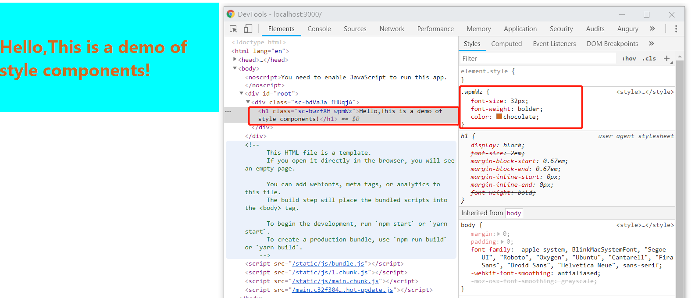

> `styled-components` 是一个常用的 `css in js` 类库。和所有同类型的类库一样，通过 `js`赋能解决了原生 `css`所不具备的能力，比如变量、循环、函数等。

## 动机

- 自动关联`css`,可以在样式定义中直接引用到 js 变量，共享变量
- 自动生成独立的类名，避免重复、重叠或拼写错误
- 简单的动态样式，不用写很多类名
- 支持组件之间继承，方便代码复用，提升可维护性
- 方便样式维护，我们只需定位到某个组件，就能快速改变其样式

## 安装

执行以下命令便能快速安装依赖：

```shell
npm install --save styled-components
```

或者

```shell
yarn add styled-components
```

## 基本用法

`styled-components`使用标签模板来对组件进行样式化。

它移除了组件和样式之间的映射。这意味着，当你定义你的样式时，你实际上只是创建了一个普通的 React 组件，你定义的样式也附在它上面。

下面我们将写两个简单的组件来说明，一个容器组件`Wrapper`,一个标题`H1`。

`Wrapper.js`

```jsx
import styled from "styled-components";

const Wrapper = styled.div`
  height: 200px;
  width: 400px;
  display: flex;
  justify-content: center;
  align-items: center;
  background: aqua;
`;

export default Wrapper;
```

`H1.js`

```jsx
import styled from "styled-components";

const H1 = styled.h1`
  font-size: 32px;
  font-weight: bolder;
  color: chocolate;
`;

export default H1;
```

`App.js`

```jsx
import React from "react";
import ReactDOM from "react-dom";
import Wrapper from "./Wrapper";
import H1 from "./H1";

function App() {
  return (
    <Wrapper>
      <H1>Hello,This is a demo of style components!</H1>
    </Wrapper>
  );
}

ReactDOM.render(<App />, document.getElementById("root"));
```

运行程序，我们就能看到如下效果：



此时，`h1`应用了我们定义的样式。

## 基于`Props`做样式判断

模板标签的函数插值能拿到样式组件的 props，可以据此调整我们的样式规则。

第一种方式：

`Button.js`

```jsx
import styled from "styled-components";

const Button = styled.button`
  min-width: 64px;
  background: ${props => (props.primary ? "blue" : "transparent")};
  color: ${props => (props.primary ? "white" : "palevioletred")};
  font-size: 14px;
  margin: 8px;
  padding: 8px;
  border: ${props => (props.primary ? "none" : `2px solid palevioletred`)};
  border-radius: 3px;
`;

export default Button;
```

上述示例中如果`primary`属性存在，则按钮背景色会变成蓝色，边框消失，并且文字颜色变成白色。

此外，我们还可以使用`css`定义一个样式，然后根据属性判断来调整我们的样式规则，这就有了第二种方式：

`Button.js`

```jsx
import styled, { css } from "styled-components";

const disabledStyle = css`
  background: transparent;
  color: rgba(0, 0, 0, 0.38);
  border: 2px solid rgba(0, 0, 0, 0.38);
`;

const Button = styled.button`
  min-width: 64px;
  background: ${props => (props.primary ? "blue" : "transparent")};
  color: ${props => (props.primary ? "white" : "palevioletred")};
  font-size: 14px;
  margin: 8px;
  padding: 8px;
  border: ${props => (props.primary ? "none" : `2px solid palevioletred`)};
  border-radius: 3px;
  ${props => props.disabled && disabledStyle};
`;

export default Button;
```

此时，如果我们给 Button 组件一个`disabled`属性，则`disabledStyle`中的样式会自动覆盖原有样式中对应的部分。

最后，我们还可以直接传入一个样式属性来控制组件样式的规则，比如，我们希望能自定义按钮的最小宽度，此时我们可以调整`Button.js`为：

```jsx
import styled from "styled-components";

const Button = styled.button`
  min-width: ${props => props.minWidth || 64}px;
  background: ${props => (props.primary ? "blue" : "transparent")};
  color: ${props => (props.primary ? "white" : "palevioletred")};
  font-size: 14px;
  margin: 8px;
  padding: 8px;
  border: ${props => (props.primary ? "none" : `2px solid palevioletred`)};
  border-radius: 3px;
`;

export default Button;
```

此时，只要我们在使用 Button 组件时，给`minWidth`属性赋值，按钮就会按照我们制定的最小宽度渲染。

## 扩展样式

样式扩展主要针对当前组件有部分样式不满足需求的情况，此时我们可以通过样式扩展来进行样式调整，比如：我们希望上面例子中的 Button 组件的边框颜色和字体颜色变成蓝色，此时我们仅仅需要下面一小段代码调整即能满足需求：

```jsx
const BlueButton = styled(Button)`
  color: blue;
  border: 2px solid blue;
`;
```

在某些场景下，我们可能不仅仅只是想要修改组件的样式，甚至想要更新组件的渲染元素，`styled-components`曾经提供了一种方式来满足我们的需求，即`.withComponent()`

方法。不幸的是在后续版本中，此方法将会被废弃。但令我们欣慰的是：`styled-components`最新版本为我们提供了一种新的方式，就是`as`属性。

假设，我们想要使用<a>来渲染我们的 Button 组件，我们仅仅需要在使用 Button 时，赋予一个`as`属性即可：

```jsx
<Button as="a" href="https://www.styled-components.com">
  Link Button
</Button>
```

同样的，我们也可以使用我们自己定义的其它组件来给`as`属性赋值。

## 自定义任意组件的样式

`styled-components`实际上也是通过`className`的方式添加样式，所以，只要我们的组件有`className`,我们就能使用`styled-components`自定义其样式。

```jsx
import React from "react";
import styled from "styled-components";

const P = ({ className, children }) => <p className={className}>{children}</p>;

const CustomP = styled(P)`
  color: blue;
  font-size: 32px;
`;

export { P, CustomP };
```

## 使用`.attrs`添加属性

我们可以使用`attrs`API 来为样式组件添加一些属性，它们也可以通过标签模板插值函数拿到 props 传值。

```jsx
import styled from "styled-components";

const PasswordInput = styled.input.attrs({
  type: "password",
  margin: props => props.size || "1em",
  padding: props => props.size || "1em"
})`
  color: palevioletred;
  font-size: 1em;
  border: 2px solid palevioletred;
  border-radius: 3px;
  margin: ${props => props.margin};
  padding: ${props => props.padding};
`;

export default PasswordInput;
```

## 动画

带有`@keyframes`的`CSS animations`，一般来说会产生复用。`styled-components`暴露了一个`keyframes`的`API`，我们使用它产生一个可以复用的变量。这样，我们在书写`css`样式的时候使用 JavaScript 的功能，为`CSS`附能，并且避免了名称冲突。

```jsx
import styled, { keyframes } from "styled-components";

const rotateStyle = keyframes`
    from {
    transform: rotate(0deg);
  }

    to {
    transform: rotate(360deg);
  }
`;

const Rotate = styled.div`
  display: inline-block;
  animation: ${rotateStyle} 2s linear infinite;
  padding: 2rem 1rem;
  font-size: 1.2rem;
`;

export default Rotate;
```

## 附注

有时候可能由于优先级的问题，我们自定义的样式无法使用，此时我们只需要使用`&&`就能提升其优先级：

```jsx
const CustomButton = styled(Button)`
  && {
    width: 88px;
  }
`;
```

## 总结

这篇文章主要介绍了`styled-components`的基本用法，包括通过属性控制样式规则、样式扩展、自定义组件样式、使用`.attrs`添加属性、动画等，希望可以通过阅读此文章数量掌握如何使用`styled-components`定义组件样式。

[查看示例源码](https://github.com/sinoui/style-demo)

## 参考文章

[styled-components 官网](https://www.styled-components.com)

[Styled-Components](https://segmentfault.com/a/1190000014682665)
